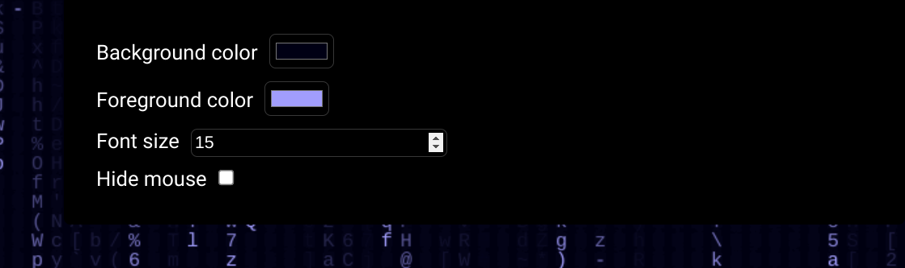

  
 

<h1 align="center">Matrix Rain</h1>
<h3 align="center">A customizable matrix rain background</h3>

simply open the app [here](https://imagineeeinc.github.io/matrix-rain/), put it on fullscreen and hack the matrix!

<h2 align="center">Customizing</h2>

to customize go to the top right of the website and and a button will appear, click it.

A window on the top right corner will appear.

Here you can customize the background colour, the foreground colour, the text size and hiding the mouse (do note hiding the mouse will make it harder to navigate the page so be aware)

Then press the button in the top right again to close the panel.

Now have fun hacking the matrix.

## License
This project is under [MIT License](https://github.com/imagineeeinc/matrix-rain/blob/main/LICENSE)
